# HTML Reinforcement Revision 1

## Instructions

You are encouraged to read up and research if you are unsure of your answers. 

### Submission of answers

#### Submission via Google Forms

Please use code sandbox to submit your answers. Click on "share > copy sandbox link" and paste the link to the Google form provided.

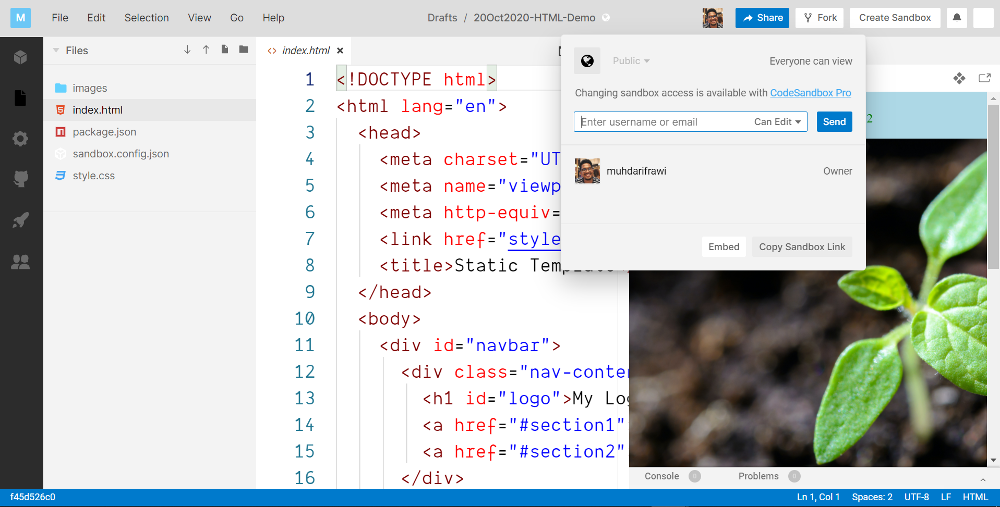

#### Submission via GitHub

Open up the assignment page and click on the "Add or create" button then select "link".

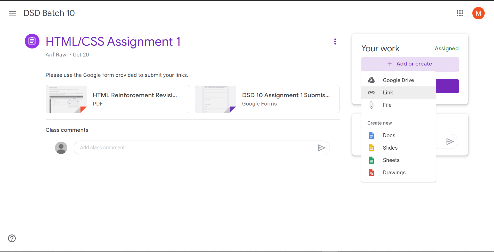

When the prompt appears, paste in your GitHub repository URL that contains the solutions.


The GitHub repository URL is as shown.

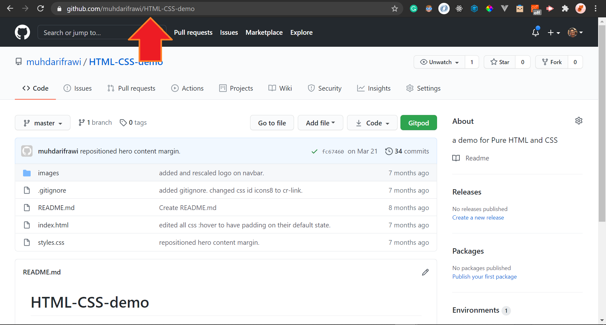

Once you have loaded it successfully, click on the "Turn In" button.

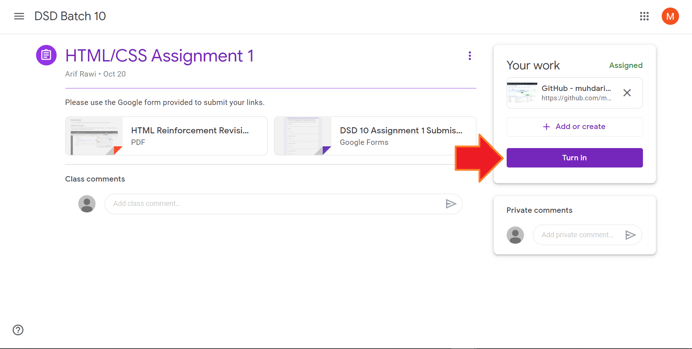

<hr>

## Contents

[Question 1](#question-1-back-to-contents)<br>
[Question 1 Preview](#question-1-preview-back-to-contents)<br>
[Question 2](#question-2-back-to-contents)<br>
[Question 2 Preview](#question-2-preview-back-to-contents)<br>
[Question 3](#question-3-back-to-contents)<br>
[Question 3 Preview](#question-3-preview-back-to-contents)<br>
[Question 4](#question-4-back-to-contents)<br>
[Question 4 Preview](#question-4-preview-back-to-contents)<br>
[Question 5](#question-5-back-to-contents)<br>
[Question 5 Preview](#question-5-preview-back-to-contents)<br>
[Question 6](#question-6-back-to-contents)<br>
[Question 6 Preview](#question-6-preview-back-to-contents)<br>
[Question 7](#question-7-back-to-contents)<br>
[Question 7 Preview](#question-7-preview-back-to-contents)<br>

<hr>

## Question 1 <a style="font-size:8pt;" href="#contents">[back to contents]</a>

Given that a typical HTML boiler plate is as such:

```html
<!DOCTYPE html>
<html>
  <head>
    <meta charset="utf-8">
    <meta name="viewport" content="width=device-width">
    <link href="style.css" type="text/css" rel="stylesheet">
    <title>Document</title>
  </head>
  <body>
      
      <script src="script.js"></script>
  </body>
</html>
```

Create a **single page** webpage that consists of a title, two subtitles and two paragraphs.

The title should say "Myself". The first subtitle should be "About Me" while the second should be "My Ambition". The paragraphs should contain information related to the Subtitles. The diagram below shows a rough example of how it would look.

### Question 1 Preview <a style="font-size:8pt;" href="#contents">[back to contents]</a>

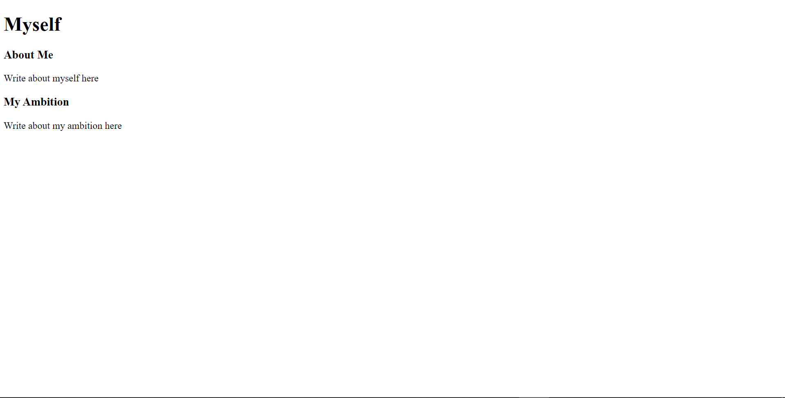

<hr>

## Question 2 <a style="font-size:8pt;" href="#contents">[back to contents]</a>

Create a **single page** webpage that would reflect on how a recipe guide would look like.

The recipe guide would have the following:

1. Title of the recipe
2. Summary of the recipe
3. Ingredients needed
4. The steps of the recipe

The main title should be larger than the subtitles. Ingredients and steps of the recipes **must be in the proper list formats**. 

### Question 2 Preview <a style="font-size:8pt;" href="#contents">[back to contents]</a>

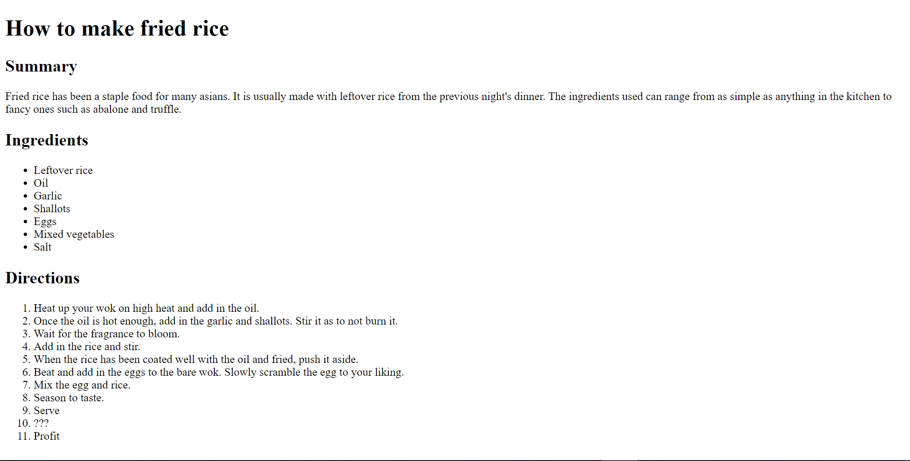

<hr>

## Question 3 <a style="font-size:8pt;" href="#contents">[back to contents]</a>

Based on question 2, create another **single page** webpage that is exactly as you've done in question 2. However this time around, each section (summary, ingredients and steps) would have a different background color and different colored texts.

The choice of colors are to your discretion. 

Additionally, add anywhere in the page that says "&copy; Copyright of the Eat & Eat Corps. 2020"

### Question 3 Preview <a style="font-size:8pt;" href="#contents">[back to contents]</a>

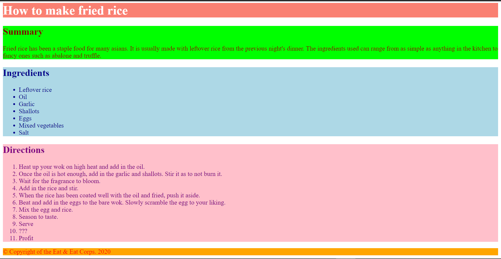

<hr>

## Question 4 <a style="font-size:8pt;" href="#contents">[back to contents]</a>

Create a **single page** webpage that has a title, an image of a bread and a description of what that bread is.

### Question 4 Preview <a style="font-size:8pt;" href="#">[back to contents]</a>

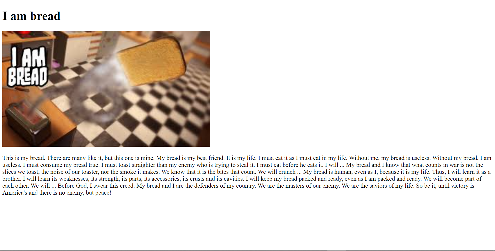

<hr>

## Question 5 <a style="font-size:8pt;" href="#contents">[back to contents]</a>

Create a **single page** webpage that has a form in it. The form is meant for a fictional restaurant for customers to reserve tables.

The form should take in the following data:

- Name 
- Phone number
- Number of people expected
- Single selection of time: breakfast, lunch or dinner
- Single selection of : smoking or non-smoking
- Multiple selections for common allergies
- A submit button and a cancel button

To guide you through, the preview shows the type of available inputs that are possible to be used.

### Question 5 Preview <a style="font-size:8pt;" href="#contents">[back to contents]</a>

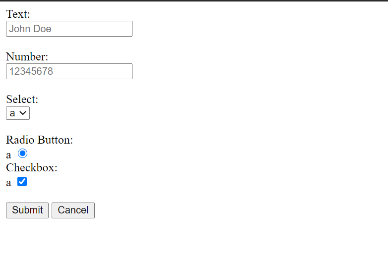

<hr>

## Question 6 <a style="font-size:8pt;" href="#contents">[back to contents]</a>

Create **three webpages** that are linked to each other. The webpages must be named index.html, second.html and third.html.

Each webpage should have titles that indicates which page the user is currently on. 

### Question 6 Preview <a style="font-size:8pt;" href="#contents">[back to contents]</a>

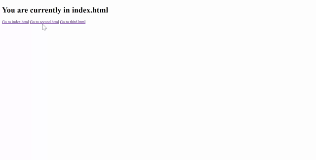

<hr>

## Question 7 <a style="font-size:8pt;" href="#contents">[back to contents]</a>

Create three sections in a **single page** webpage. At the very top of the page, there would be three links that would allow users to navigate to the respective section. I.e. : Clicking on section 3 would lead users to section 3 of the page.

### Question 7 Preview <a style="font-size:8pt;" href="#contents">[back to contents]</a>

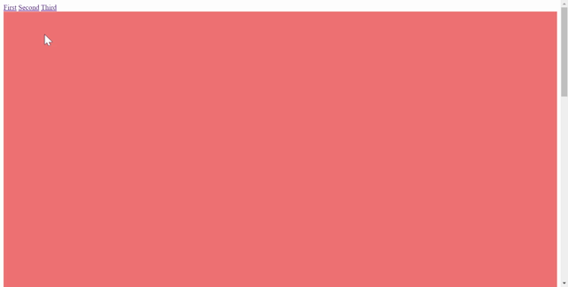


